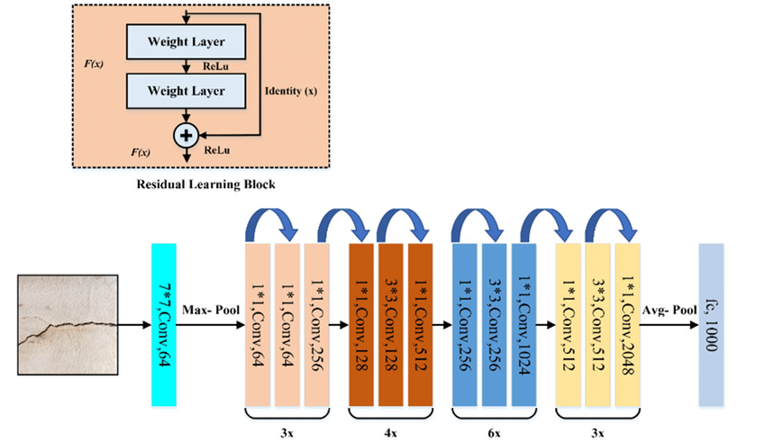
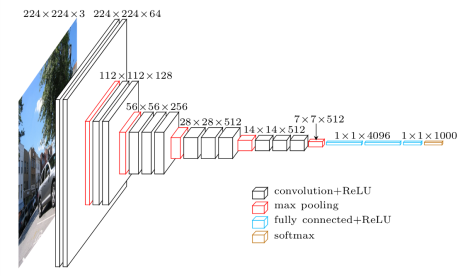
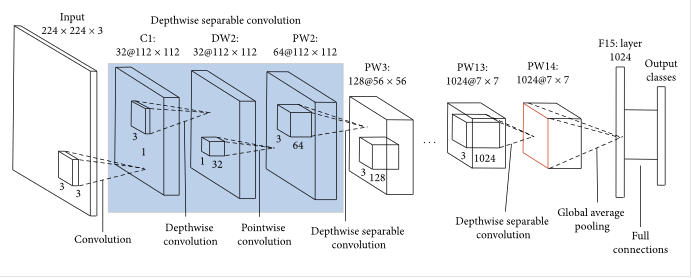
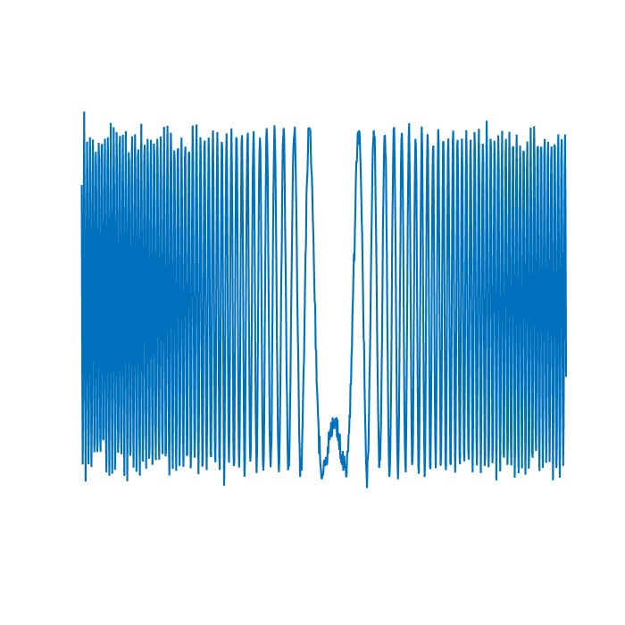
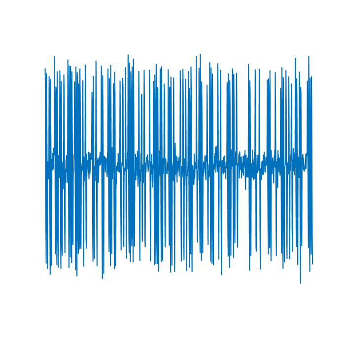
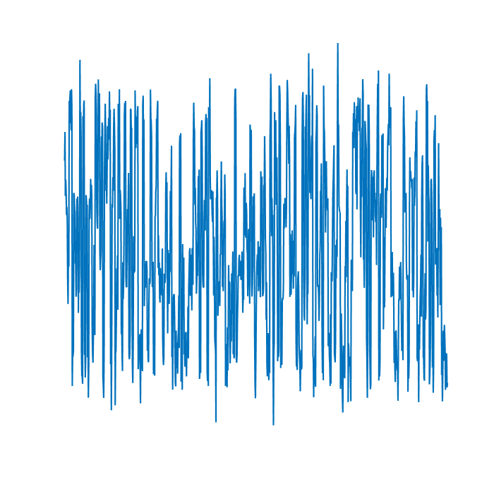

# Clasificador modulaciones

## Índice
- [Introducción](#introducción)
- [Transfer Learning](#transfer-learning)
- [ResNet](#resnet)
- [VGG](#vgg)
- [MobileNet](#mobilenet)
- [Herramientas](#herramientas)
- [Generación dataset](#Generación-dataset)
- [Resultados](#Resultados)

## Introducción
El objetivo de este proyecto es realizar un modelo de deeplearning capaz de clasificar la modulaciónde una señal cn un precisión adecuada.
Para realizar dicha clasificación al modelo se le va a pasar una imagen conteniendo la representación del valor real de la señal en el dominio temporal de la señal.

Se ha escogido el análisis en el dominio del tiempo, debido a que el espectro de muchas de las modulaciones es muy similar, y con la frecuencia de muestreo escogida no es posible realizar una clasificación adecuada.


A modo de comparación, el modelo entrenado se va a comparar con el dataset generado en el repositorio [repositorio kaggle](https://www.kaggle.com/competitions/deep-learning-based-modulation-classification/overview).

Para entrenar los modelos se han empleado técnicas de transferlearning, descritos en el siguiente [apartado](#tranfer-learning).


## Transfer Learning
El **Transfer Learning** es una técnica de aprendizaje automático que se centra en almacenar el conocimiento adquirido al resolver un problema y aplicarlo a un problema diferente pero relacionado. En otras palabras, en lugar de empezar el aprendizaje desde cero, el modelo utiliza conocimientos previamente aprendidos de una tarea para mejorar o acelerar el aprendizaje en otra nueva tarea.

## ResNet
**ResNet**, que significa Redes Residuales, es un tipo de arquitectura de red neuronal que facilita el entrenamiento de redes mucho más profundas mediante el uso de conexiones residuales. Estas conexiones permiten que las señales salten capas, lo que ayuda a combatir el problema del desvanecimiento de gradientes en redes profundas.



## VGG
**VGG** es un modelo de red neuronal que fue uno de los primeros en utilizar arquitecturas profundas y homogéneas, donde todas las capas ocultas son convolucionales y tienen el mismo campo receptivo (3x3). Este diseño ha demostrado ser muy efectivo para tareas de visión por computadora, como clasificación de imágenes.


## MobileNet
**MobileNet** es una arquitectura de red neuronal optimizada para su uso en dispositivos móviles y en entornos con recursos limitados. Utiliza técnicas como separaciones de convoluciones en profundidad para reducir el número de parámetros y la cantidad de cálculos necesarios, lo cual es ideal para aplicaciones en tiempo real.


## Herramientas
En este proyecto se han utilizado varias herramientas de vanguardia en el campo del aprendizaje automático y el desarrollo de aplicaciones. A continuación, se describe cada una de ellas.

### Optuna
**Optuna** es una biblioteca de optimización de hiperparámetros diseñada específicamente para la automatización del ajuste de hiperparámetros. Optuna permite definir un espacio de búsqueda complejo de hiperparámetros y utiliza varios algoritmos de optimización para encontrar de manera eficiente la mejor configuración. Esta herramienta es ampliamente utilizada en el ámbito del aprendizaje automático para mejorar el rendimiento de los modelos al ajustar parámetros como la tasa de aprendizaje, el número de capas en una red neuronal, o la cantidad de nodos en cada capa.

### PyTorch
**PyTorch** es un framework de aprendizaje profundo y computación tensorial con aceleración de GPU. Es conocido por su flexibilidad y su diseño intuitivo, lo que facilita tanto la investigación experimental como el desarrollo de aplicaciones de producción. PyTorch proporciona una rica API para operaciones tensoriales y una gran colección de herramientas y bibliotecas preconstruidas para visión por computadora, procesamiento del lenguaje natural y más. En este proyecto, PyTorch se utiliza para construir y entrenar modelos de redes neuronales.

### Streamlit
**Streamlit** es una herramienta que permite a los desarrolladores crear aplicaciones web para proyectos de ciencia de datos y aprendizaje automático de manera rápida y con poco esfuerzo. Con Streamlit, es posible transformar scripts de análisis de datos en aplicaciones web interactivas sin necesidad de utilizar frameworks web tradicionales. Es ideal para prototipar rápidamente y compartir los resultados del proyecto, ofreciendo widgets interactivos para manipular los datos o ajustar los parámetros del modelo directamente desde la interfaz de usuario.

### MATLAB
**MATLAB** es un entorno de programación y lenguaje de programación de alto nivel utilizado principalmente para computación numérica. Desarrollado por MathWorks, MATLAB permite la manipulación de matrices, la representación gráfica de funciones y datos, la implementación de algoritmos y la creación de interfaces de usuario. En el campo del aprendizaje automático y el análisis de datos, MATLAB ofrece cajas de herramientas especializadas para el procesamiento de señales, aprendizaje automático, redes neuronales, y más, facilitando el desarrollo y la simulación de modelos complejos.

## Generación del Dataset
Para este proyecto, he creado un conjunto de datos sintético que involucra una mezcla de diversas modulaciones tanto analógicas como digitales. La creación de un dataset sintético me permitió tener un control completo sobre las características del mismo, lo que es esencial para las pruebas específicas y la validación del modelo de aprendizaje automático. 

En total se han generado 170000 muestras de señales ditribuidas de forma uniforme en todas las clases. Además se ha impuesto una relación señal a ruido aleatoria en todas las señales, con valores oscilando entre SNR de -20 a 30.


### Características Técnicas del Dataset
- **Frecuencia de Muestreo:** 200,000 Hz (200 kHz).
- **Longitud de las Señales:** 0.005 segundos (5 ms), lo que proporciona un total de 1,000 muestras por señal considerando la frecuencia de muestreo.

### Modulaciones Utilizadas
#### Modulaciones Analógicas
- **AM (Modulación de Amplitud):** En AM, la amplitud de la señal portadora varía en proporción a la señal de información (moduladora) manteniendo constante la frecuencia y la fase.
- **FM (Modulación de Frecuencia):** En FM, la frecuencia de la señal portadora varía según la señal de información, mientras que la amplitud se mantiene constante.
- **PM (Modulación de Fase):** PM implica variar la fase de la señal portadora basada en la señal de información.

#### Modulaciones Digitales
- **ASK (Amplitude-Shift Keying):** Una forma de modulación donde la amplitud de la señal portadora se alterna entre dos niveles dependiendo de los datos binarios.
- **FSK (Frequency-Shift Keying):** En FSK, la frecuencia de la señal portadora se cambia entre dos valores discretos para representar los bits de datos.
- **PSK (Phase-Shift Keying):** PSK es una técnica donde la fase de la señal portadora se modifica para representar los datos. Se utilizó:
  - **BPSK (Binary Phase-Shift Keying):** La fase se cambia entre dos valores distintos para representar los dos estados binarios.
  - **QPSK (Quadrature Phase-Shift Keying):** Donde la fase de la señal toma uno de los cuatro valores posibles, permitiendo codificar dos bits por símbolo.
- **QAM (Quadrature Amplitude Modulation):** Combina AM y PM para aumentar la eficiencia de ancho de banda, utilizando amplitud y fase para codificar la información. Las variantes usadas incluyen:
  - **16QAM**
  - **8QAM**
  - **32QAM**
  - **64QAM**

Este conjunto de modulaciones proporciona una diversidad rica y compleja en el dataset, ideal para evaluar y entrenar algoritmos de clasificación y análisis de señales en comunicaciones.

A modo de ejemplo se adjuntan algunas imágenes de señales generadas:

**Señal FM**



**Señal ASK**



**Señal 8QAM**



Para poder ver en profundidad la forma de onda de las señales generadas, se recomienda ver el fichero **genDatasetVisualizacion.pdf**, en el que se van a encontrar todas las clases generadas.

# Tranformaciones
Antes de pasar la imagen por el modelo, se le realizan las siguientes transformaciones:
- Cambio tamaño: Debido a que se está realizando transferlearning, los modelos empleados necesitan que la imagen de entrada sea de 224 x 224 pixeles, parámetro que no se pudo cambiar a la hora de realizar el dataset sintético. Por ello cada vez que se carga una imagen, es necesario adaptar el tamaño al exigido por el modelo.
```
transforms.Resize(size=(224,224))
```
- Transformación a escala de grises: los modelos base empleados requieren que la señal de entrada sea una imagen de tres canales, es decir que la imagen tenga color. Pero en la representación temporal de la imagen, el color no aporta información al modelo, y hace que el entrenamiento sea ligeramente más largo, es por ello que antes de pasar la imagen al modelo, se realiza la conversión a escala de grises, pero manteniendo los tres canales necesarios. 
```
transforms.Grayscale(num_output_channels=3)
```


## Resultados
Una vez que se han entrenado los diferentes modelos, se va a evaluar su desempeño comparándo primero sus estadísticas absolutas y luego comparando entre ellos el desempeño.
A la hora de evaluar el desempeño de un modelo sobre el dataset, se va a tener en cuenta la precisión que tiene a la hora de evaluar el dataset de validación, así como la distribución del error en las diferentes clases. De esta forma se quieren evitar modelos con alta precisiónen ciertas modulaciones y con altas tasas de error en otras.

### VGG
#### Distribución error
#### Precisión
### Mobile Net V2
#### Distribución error
#### Precisión
### Resnet 50
#### Distribución error
#### Precisión
### Mejor modelo
Derivado de los resultados anteriores, se puede derivar que el mejor modelo a la hora de clasificar 