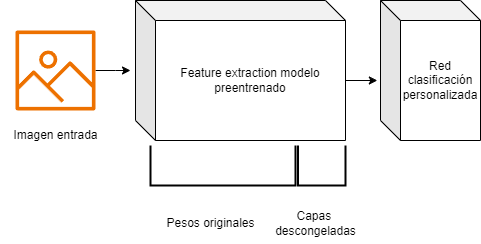
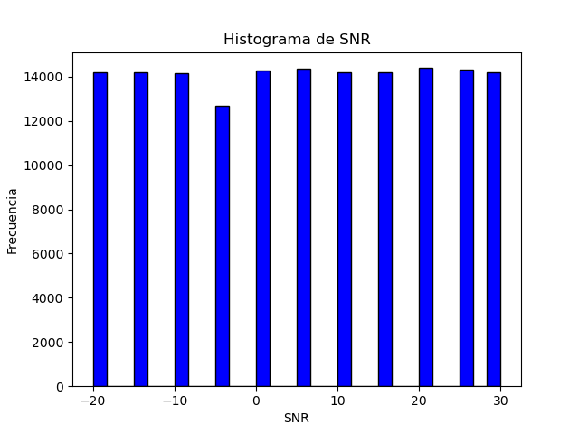
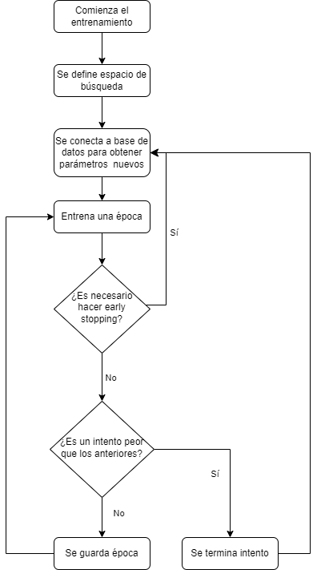
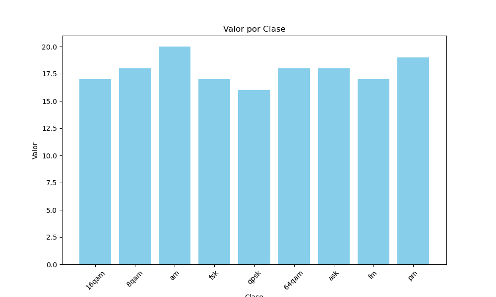
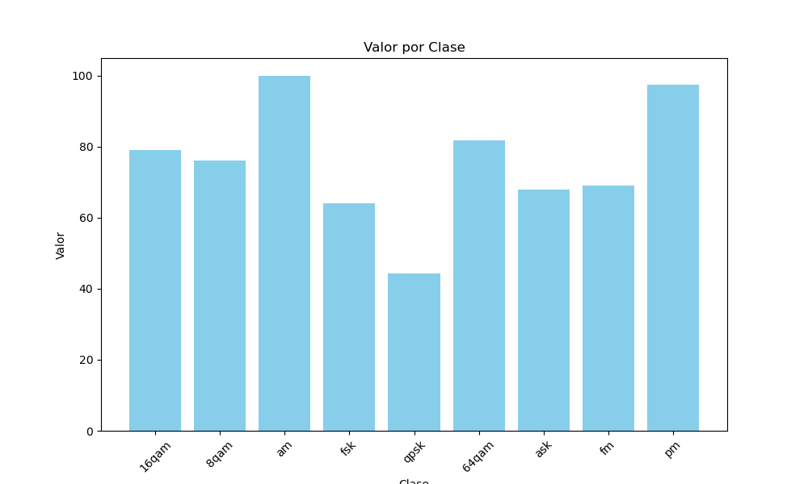
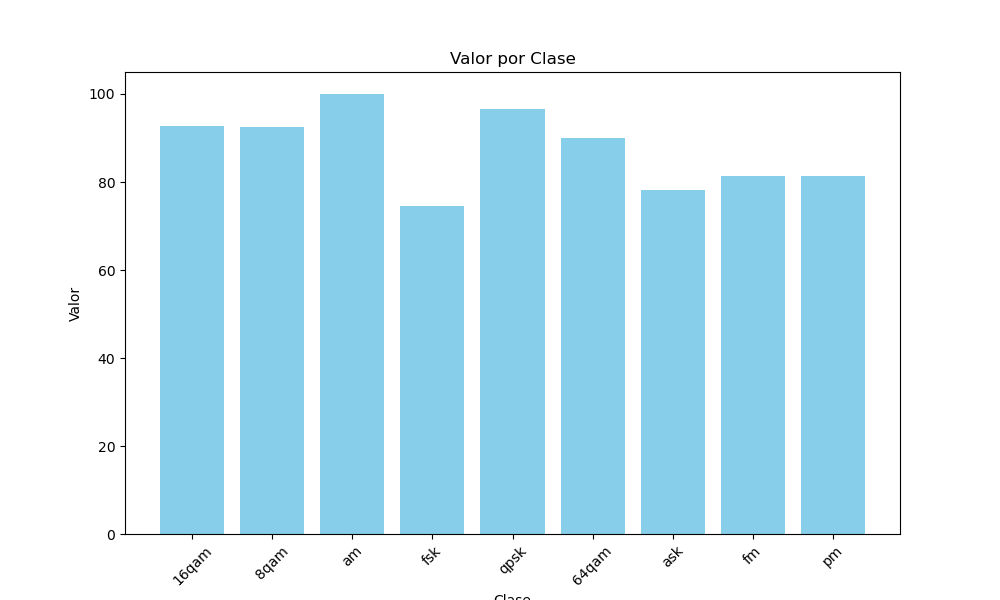

# Clasificador modulaciones

## Índice
- [Introducción](#introducción)
- [Transfer Learning](#transfer-learning)
- [ResNet](#resnet)
- [VGG](#vgg)
- [MobileNet](#mobilenet)
- [Herramientas](#herramientas)
- [Generación dataset](#generación-del-dataset)
- [Resultados](#mejor-modelo)

## Introducción
El objetivo de este proyecto es realizar un modelo de deeplearning capaz de clasificar la modulaciónde una señal cn un precisión adecuada.
Para realizar dicha clasificación al modelo se le va a pasar una imagen conteniendo la representación del valor real de la señal en el dominio temporal de la señal.

Se ha escogido el análisis en el dominio del tiempo, debido a que el espectro de muchas de las modulaciones es muy similar, y con la frecuencia de muestreo escogida no es posible realizar una clasificación adecuada.


A modo de comparación, el modelo entrenado se va a comparar con el dataset generado en el repositorio [repositorio kaggle](https://www.kaggle.com/competitions/deep-learning-based-modulation-classification/overview).

Para entrenar los modelos se han empleado técnicas de transferlearning, descritos en el siguiente [apartado](#tranfer-learning).


## Transfer Learning
El **Transfer Learning** es una técnica de aprendizaje automático que se centra en almacenar el conocimiento adquirido al resolver un problema y aplicarlo a un problema diferente pero relacionado. En otras palabras, en lugar de empezar el aprendizaje desde cero, el modelo utiliza conocimientos previamente aprendidos de una tarea para mejorar o acelerar el aprendizaje en otra nueva tarea.

Para cada modelo empleado se va a sustituir la parte de clasificación del modelo por una red neuronal personalizada. Además dentro de cada modelo preentrenado, se van a descongelar capas de forma secuencial hasta que se obtenga la precisión esperada. Esto se hace para adaptar aún más el modelo base conforme al problema de clasificación que se quire solucionar.

A modo de resumen se adjunta una ilustración en la que se diferencian las partes de los modelos finales que se va a emplear en la predicción:

<p align="center">
  
</p>

El proceso de entrenamiento en detalle se describe en el apartado [entrenamiento modelos](#entrenamiento-modelos).

Los modelos sobre los que se ha entrenado el conjunto de datos son los siguientes: 


## ResNet
**ResNet**, que significa Redes Residuales, es un tipo de arquitectura de red neuronal que facilita el entrenamiento de redes mucho más profundas mediante el uso de conexiones residuales. Estas conexiones permiten que las señales salten capas, lo que ayuda a combatir el problema del desvanecimiento de gradientes en redes profundas.


## VGG
**VGG** es un modelo de red neuronal que fue uno de los primeros en utilizar arquitecturas profundas y homogéneas, donde todas las capas ocultas son convolucionales y tienen el mismo campo receptivo (3x3). Este diseño ha demostrado ser muy efectivo para tareas de visión por computadora, como clasificación de imágenes.


## MobileNet
**MobileNet** es una arquitectura de red neuronal optimizada para su uso en dispositivos móviles y en entornos con recursos limitados. Utiliza técnicas como separaciones de convoluciones en profundidad para reducir el número de parámetros y la cantidad de cálculos necesarios, lo cual es ideal para aplicaciones en tiempo real.


## Herramientas
En este proyecto se han utilizado varias herramientas de vanguardia en el campo del aprendizaje automático y el desarrollo de aplicaciones. A continuación, se describe cada una de ellas.

### Optuna
**Optuna** es una biblioteca de optimización de hiperparámetros diseñada específicamente para la automatización del ajuste de hiperparámetros. Optuna permite definir un espacio de búsqueda complejo de hiperparámetros y utiliza varios algoritmos de optimización para encontrar de manera eficiente la mejor configuración. Esta herramienta es ampliamente utilizada en el ámbito del aprendizaje automático para mejorar el rendimiento de los modelos al ajustar parámetros como la tasa de aprendizaje, el número de capas en una red neuronal, o la cantidad de nodos en cada capa.

### PyTorch
**PyTorch** es un framework de aprendizaje profundo y computación tensorial con aceleración de GPU. Es conocido por su flexibilidad y su diseño intuitivo, lo que facilita tanto la investigación experimental como el desarrollo de aplicaciones de producción. PyTorch proporciona una rica API para operaciones tensoriales y una gran colección de herramientas y bibliotecas preconstruidas para visión por computadora, procesamiento del lenguaje natural y más. En este proyecto, PyTorch se utiliza para construir y entrenar modelos de redes neuronales.

### Streamlit
**Streamlit** es una herramienta que permite a los desarrolladores crear aplicaciones web para proyectos de ciencia de datos y aprendizaje automático de manera rápida y con poco esfuerzo. Con Streamlit, es posible transformar scripts de análisis de datos en aplicaciones web interactivas sin necesidad de utilizar frameworks web tradicionales. Es ideal para prototipar rápidamente y compartir los resultados del proyecto, ofreciendo widgets interactivos para manipular los datos o ajustar los parámetros del modelo directamente desde la interfaz de usuario.

Esta herramienta se va a emplear para poder desplegar el modelo en un entorno de producción simulado. El usuario deberá de subir a la plataforma una imagen con la representación de la parte real en el dominio del tiempo de la señal que desea clasificar, por detrás el modelo predicirá cual es el tipo de señal que se ha introducido.

### MATLAB
**MATLAB** es un entorno de programación y lenguaje de programación de alto nivel utilizado principalmente para computación numérica. Desarrollado por MathWorks, MATLAB permite la manipulación de matrices, la representación gráfica de funciones y datos, la implementación de algoritmos y la creación de interfaces de usuario. En el campo del aprendizaje automático y el análisis de datos, MATLAB ofrece cajas de herramientas especializadas para el procesamiento de señales, aprendizaje automático, redes neuronales, y más, facilitando el desarrollo y la simulación de modelos complejos.

## Generación del Dataset
Para este proyecto, he creado un conjunto de datos sintético que involucra una mezcla de diversas modulaciones tanto analógicas como digitales. La creación de un dataset sintético me permitió tener un control completo sobre las características del mismo, lo que es esencial para las pruebas específicas y la validación del modelo de aprendizaje automático. 

En total se han generado 170000 muestras de señales ditribuidas de forma uniforme en todas las clases. Además se ha impuesto una relación señal a ruido aleatoria en todas las señales, con valores oscilando entre SNR de -20 a 30.

Para comprobar que el dataset generado está balanceado y que no tiene sesgo hacia valores de SNR, se ha obtenido el siguiente histograma representando los valores de SNR en todo el conjunto de datos:


<p align="center">
  
</p>

Por inspección visual se puede comprobar como el dataset es apropiado y los valores se encuentran distribuidos de forma uniforme.

### Características Técnicas del Dataset
- **Frecuencia de Muestreo:** 200,000 Hz (200 kHz).
- **Longitud de las Señales:** 0.005 segundos (5 ms), lo que proporciona un total de 1,000 muestras por señal considerando la frecuencia de muestreo.

### Modulaciones Utilizadas
#### Modulaciones Analógicas
- **AM (Modulación de Amplitud):** En AM, la amplitud de la señal portadora varía en proporción a la señal de información (moduladora) manteniendo constante la frecuencia y la fase.
- **FM (Modulación de Frecuencia):** En FM, la frecuencia de la señal portadora varía según la señal de información, mientras que la amplitud se mantiene constante.
- **PM (Modulación de Fase):** PM implica variar la fase de la señal portadora basada en la señal de información.

#### Modulaciones Digitales
- **ASK (Amplitude-Shift Keying):** Una forma de modulación donde la amplitud de la señal portadora se alterna entre dos niveles dependiendo de los datos binarios.
- **FSK (Frequency-Shift Keying):** En FSK, la frecuencia de la señal portadora se cambia entre dos valores discretos para representar los bits de datos.
- **PSK (Phase-Shift Keying):** PSK es una técnica donde la fase de la señal portadora se modifica para representar los datos. Se utilizó:
  - **BPSK (Binary Phase-Shift Keying):** La fase se cambia entre dos valores distintos para representar los dos estados binarios.
  - **QPSK (Quadrature Phase-Shift Keying):** Donde la fase de la señal toma uno de los cuatro valores posibles, permitiendo codificar dos bits por símbolo.
- **QAM (Quadrature Amplitude Modulation):** Combina AM y PM para aumentar la eficiencia de ancho de banda, utilizando amplitud y fase para codificar la información. Las variantes usadas incluyen:
  - **16QAM**
  - **8QAM**
  - **32QAM**
  - **64QAM**

Este conjunto de modulaciones proporciona una diversidad rica y compleja en el dataset, ideal para evaluar y entrenar algoritmos de clasificación y análisis de señales en comunicaciones.

A modo de ejemplo se adjuntan algunas imágenes de señales generadas:

**Señal FM**
<p align="center">

</p>

**Señal ASK**


<p align="center">
  
</p>

**Señal 8QAM**
<p align="center">
  
</p>
Para poder ver en profundidad la forma de onda de las señales generadas, se recomienda ver el fichero <strong>genDatasetVisualizacion.pdf</strong>, en el que se van a encontrar todas las clases generadas.


# Tranformaciones
Antes de pasar la imagen por el modelo, se le realizan las siguientes transformaciones:
- Cambio tamaño: Debido a que se está realizando transferlearning, los modelos empleados necesitan que la imagen de entrada sea de 224 x 224 pixeles, parámetro que no se pudo cambiar a la hora de realizar el dataset sintético. Por ello cada vez que se carga una imagen, es necesario adaptar el tamaño al exigido por el modelo.
```
transforms.Resize(size=(224,224))
```
- Transformación a escala de grises: los modelos base empleados requieren que la señal de entrada sea una imagen de tres canales, es decir que la imagen tenga color. Pero en la representación temporal de la imagen, el color no aporta información al modelo, y hace que el entrenamiento sea ligeramente más largo, es por ello que antes de pasar la imagen al modelo, se realiza la conversión a escala de grises, pero manteniendo los tres canales necesarios. 
```
transforms.Grayscale(num_output_channels=3)
```
## Entrenamiento modelos
Para realizar el entrenamiento de los modelos, se va a hacer uso de varias técnicas y herramientas.

La primera de todas es que se va a hacer uso de Optuna como herramienta para encontrar los parámetros óptimos del modelo. En concreto en este modelo se han optimizado: la tasa de aprendizaje, el número de capas en una red neuronal de clasificación, el número de neuronas en cada capa, el valor de dropout de la capa previa cada capa lineal en el segmento de clasificación. 

Para poder encontrar los parámetros óptimos, se tiene que definir un espacio de búsqueda de estos. 
Optuna ejecuta esta función objective, la cual realiza el entrenamiento y devuelve un valor de rendimiento que Optuna usa para guiar la búsqueda de la configuración óptima.

Por otro lado, para evitar tanto overfitting, como tiempos de entrenamiento elevados en epochs que ya no aportan beneficio en el conjunto de validación, se va a incorporar un algoritmo de early stopping.

Este algoritmo obtiene el error de validación en cada una de las iteraciones del entrenamiento, si el error de validación no disminuye en 30 iteraciones, el intento se considera como finalizado y se deja de entrenar. Después de esto se buscan otros parámetros nuevos obtenidos de optuna, y se comienza el proceso de nuevo.

El diagrama de flujo seguido en el entrenamiento es el siguiente:

<p align="center">
  
</p>

## Resultados
Una vez que se han entrenado los diferentes modelos por medio de técnicas de transfer learning, se va a evaluar su desempeño comparándo primero sus estadísticas absolutas y luego comparando entre ellos el desempeño.

A la hora de evaluar rendimiento de un modelo sobre el dataset, se va a tener en cuenta la precisión que tiene a la hora de evaluar el dataset de validación, así como la distribución del error en las diferentes clases. De esta forma se quieren evitar modelos con alta precisiónen ciertas modulaciones y con altas tasas de error en otras.

Además se va a tener en cuenta la diferencia entre el error en el conjunto de validación y el error en el conjunto de entrenamient, de esta forma se evita que exista overfitting del modelo al conjunto de entrenamiento.

Al realizarse el entrenamiento por medio de optuna, se pueden obtener cuales son los parámetros que más influyen a la hora de hacer que el modelo sea apropiado. Esto también puede dar una idea de cuales pueden ser los puntos de mejora, ya que un pequeño cambio en el parámetro puede influir de forma significativa en el desempeño del modelo

### VGG
#### Entrenamiento
Al entrenar el modelo <vgg> con diversas variaciones de parámetros, se produce el siguiente gráfico que ilustra la precisión alcanzada en diferentes epochs frente al número de intentos:


Como se puede apreciar, todos los intentos tienen una precisión similar, indicando que el modelo obtenido está en la media de todos los realizados.

#### Importancia parámetros
Al evaluar cuál parámetro tiene mayor influencia en la precisión del modelo, se ha generado el siguiente gráfico:


Como es de esperar, entre los parámetros más importantes se encuentran tanto el número de neuronas como el factor de regularización del dropout, ya que es el que decide que cantidad de información pasa hacia la siguente capa.

#### Distribución error


Tras evaluar la distribución del error en todo el dataset, se ha obtenido la siguiente gráfica:

<p align="center">
  
</p>

A pesar de que la precisión final es bastante reducida. La distribución del error de clasificación es bastante positiva, no hay ninguna clase que resalte por la demás salvo por variaciones de 3 puntos de precisión.

Si no fuera por la baja precisión final, este modelo sería apropiado para la clasificación de modulaciones.
#### Precisión

Al finalizar el entrenamiento se realiza el análisis de la precisión del modelo. Este modelo tiene una precisión del 18% en el conjunto de validación.

Como se puede observar en las dos imágenes inferiores, la evolución del error con respecto a los epochs de entrenamiento es no es lo ficientemente acusada como para justificar seguir entrenando el modelo.

Por otro lado,la diferencia entre la precisión en el conjunto de validación y el de entrenamiento no es lo suficientemente grande como para afirmar que el modelo presente overfitting.


Además se ha obtenido la curva del error a medida que se avanza en el entrenamiento:


La precisión del modelo no es lo suficientemente alta, pero el modelo no presenta overfitting.
Este modelo no es adecuado para esta tarea de clasificación.

### Mobile Net V2
#### Entrenamiento
Al realizar el entrenamiento con diferentes variaciones de parámetros sobre el modelo MobileNet, se obtiene el siguiente gráfico de intentos frente a precisión en los diferentes epochs:


Efectivamente existe una tendencia de todos los modelos hacia precisiones altas, por lo que el echo de obtener este modelo no es un outlier del proceso de entrenamiento, si no que tiene sentido a nivel global.

#### Importancia parámetros
A la hora de evaluar cual es el parámetro que más influye a la hora de determinar la precisión, se ha obtenido el siguiente gráfico:


Es reseñable destacar que los dos parámetros que más influencia tienen en el modelo son el número de capas y el factor de dropout de la segunda capa de la red de clasificación. Esto tiene sentido, puesto que es en las primeras capas donde más información se extrae de las features del segmento de **feature extraction**

#### Distribución error
Tras evaluar la distribución del error en todo el dataset, se ha obtenido la siguiente gráfica:

<p align="center">
  
</p>

La clase que peor se clasifica en este caso es la clase de QPSK, esto puede ser debido a que el modelo es peor clasificando señales con amplitud constante, y confunde esta modulación con otras que también tienen amplitud constante como por ejemplo la familia de las de modulación en cuadratura (xQAM).

#### Precisión
Al finalizar el entrenamiento se realiza el análisis de la precisión del modelo. Este modelo tiene una precisión del 92% en el conjunto de validación.

Como se puede observar en las dos imágenes inferiores, la evolución del error con respecto a los epochs de entrenamiento es adecuada, además la diferencia entre la precisión en el conjunto de validación y el de entrenamiento no es lo suficientemente grande como para afirmar que el modelo presente overfitting.


Además se ha obtenido la curva del error a medida que se avanza en el entrenamiento. 


Esta curva es apropiada puesto que el error disminuye de forma apropiada a medida que avanza el entrenamiento.
### Resnet 50
#### Entrenamiento
Cuando se entrena el modelo de Resnet50 con diferentes configuraciones de parámetros, se genera el siguiente gráfico que muestra la relación entre los intentos y la precisión en distintos epochs:


De esta gráfica se deriva que existe una variedad de modelos que sí que son adecuados para la tarea descrita, mientras que existe una variedad de combinaciones que no proporcionan resultados adecuados. 

Para el modulo evaluado se ha escogido el modelo del conjunto de modelos apropiado.

#### Importancia parámetros
Al evaluar cuál es el parámetro que más impacta en la precisión del modelo, se ha generado el siguiente gráfico:


Cabe destacar que en este caso el parámetro más importante en la clasificación de las modulaciones es la tasa de aprendizaje. Indicando que en este modelo, la parte de extracción de features del modelo preentrenado está siendo mucho más importe que la parte de clasificación añadida posteriormente.

#### Distribución error
Tras evaluar la distribución del error en todo el dataset, se ha obtenido la siguiente gráfica:

<p align="center">
  
</p>

Es apreciable una disminución en la precisión total del modelo. Esto es debido a que el error en la clasificación de la modulación digital FSK es es mucho mayor a la de las demás modulaciones.

Este resultado tiene sentido puesto que es la modulación más parecida a todas las presentes. Es de amplitud constante, al igual que las xQAM, y varía la frecuencia como en las analógicas.

#### Precisión
Al finalizar el entrenamiento se realiza el análisis de la precisión del modelo. Este modelo tiene una precisión del 89% en el conjunto de validación.

Como se puede observar en las dos imágenes inferiores, la evolución del error con respecto a los epochs de entrenamiento es adecuada, además la diferencia entre la precisión en el conjunto de validación y el de entrenamiento no es lo suficientemente grande como para afirmar que el modelo presente overfitting.


Además se ha obtenido la curva del error a medida que se avanza en el entrenamiento. 


Esta curva es apropiada puesto que el error disminuye de forma apropiada a medida que avanza el entrenamiento. Además la diferencia de la precisión y el error entre el conjunto de entrenamiento y el conjunto de validación es lo suficientemente pequeña como para afirmar que el modelo propuesto no tiene overfitting del conjunto de entrenamiento
### Mejor modelo
Derivado de los resultados anteriores, se puede derivar que el mejor modelo a la hora de clasificar las modulaciones es el que hace transfer learning sobre **Resnet50** , se puede observar la evolución de la precisión del modelo es adecuada y que tiene una distribución del error proporcionada. En este caso se prefiere encontrar un modelo capaz de generalizar mejor a tener una precisión muy alta en algunas clases y baja en otras, es por ello que se ha preferido.

Es cierto que este modelo tiene una precisión mucho menor a la hora de clasificar la modulación digital FSK. En futuras iteraciones se debería de aumentar el número de muestras de esta modulación con el fin de incrementar la precisión del modelo en esta.

Como norma general se ha visto un decremento de la precisión a la hora de evaluarlo con el dataset global. Esto es porque se han guardado muestras que no se han visto ni en el entrenamiento ni en la validación. Se ha hecho esto para simular un entorno real en el que el modelo no puede ver todas las muestras.
